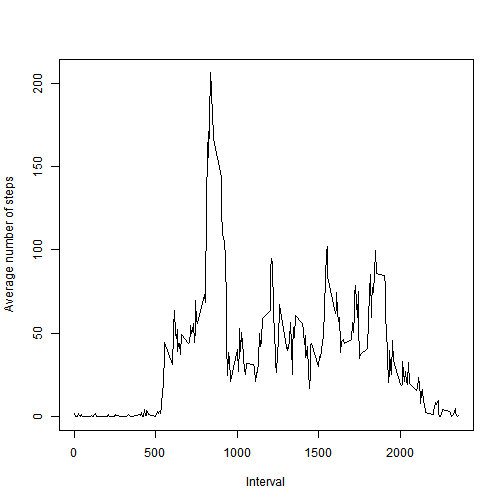
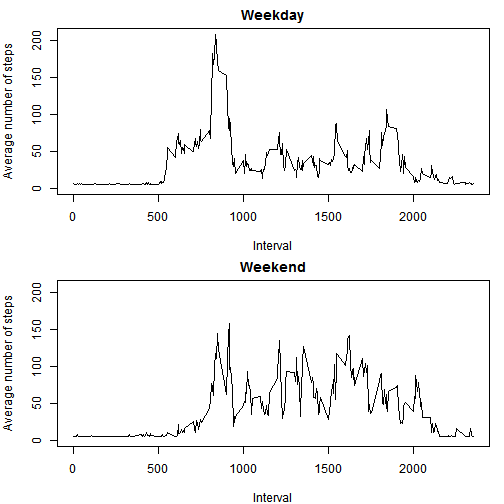

**This report contains the assignment 1 for the Cousera Reproducible Research 

### Loading and preprocessing the data

```r
activity = read.csv("activity.csv", header = TRUE, sep = ",")
activity$date = as.Date(activity$date)
```

### What is mean total number of steps taken per day?
I calculated the total number of steps taken per day

```r
activity_steps = aggregate(steps~date, data = activity, sum)
```

I made a histogram of the total number of steps taken each day

```r
library(ggplot2)
ggplot(activity_steps, aes(x=date, y = steps)) + geom_bar(stat="identity")
```


I calculated and reported the mean and median of the total number of steps taken per day

```r
mean(activity_steps$steps)
```

```
## [1] 10766.19
```

```r
median(activity_steps$steps)
```

```
## [1] 10765
```

### What is the average daily activity pattern?

Now I made a time series plot (i.e. type = "l") of the 5-minute interval (x-axis) and the average number of steps taken, averaged across all days (y-axis)


```r
activity_interval = aggregate(steps~interval, data = activity, mean)
plot(activity_interval$interval, activity_interval$steps, type = "l")
```



I calculated the 5-minute interval, on average across all the days in the dataset that contains the maximum number of steps.


```r
activity_interval[activity_interval$steps == max(activity_interval$steps),]$interval
```

```
## [1] 835
```

### Imputing missing values

I calculated and reported the total number of missing values in the dataset.

```r
nrow(activity[is.na(activity)==TRUE,])
```

```
## [1] 2304
```

I invented a strategy for filling in all of the missing values in the dataset. I filled the missing data with the mean of the steps and I created a new dataset that is equal to the original dataset but with the missing data filled in.

```r
activity_new = activity
activity_new[is.na(activity_new)] = mean(activity_new$steps, na.rm = TRUE)
```

Make a histogram of the total number of steps taken each day 

```r
activity_new_hist = aggregate(steps~date, data = activity_new, sum)
ggplot(activity_new_hist, aes(x=date, y = steps)) + geom_bar(stat="identity")
```


I calculated the mean and median total number of steps taken per day but these values now are almost the same after replace missing values.

There isn't impact of imputing missing data on the estimates of the total daily number of steps.


```r
mean(activity_new_hist$steps)
```

```
## [1] 10766.19
```

```r
median(activity_new_hist$steps)
```

```
## [1] 10766.19
```

### Are there differences in activity patterns between weekdays and weekends?

I created a new factor variable in the dataset called week with two levels - "weekday" and "weekend" indicating whether a given date is a weekday or weekend day.

I made a panel plot containing a time series plot of the 5-minute interval (x-axis) and the average number of steps taken, averaged across all weekday days or weekend days (y-axis).


```r
activity_new$week = ifelse(weekdays(as.Date(activity_new$date)) %in% c("Saturday","Sunday"), "weekend", "weekday")

activity_new = aggregate(steps~week+interval, data = activity_new, mean)
activity_weekday = activity_new[activity_new$week == "weekday",]
activity_weekend = activity_new[activity_new$week == "weekend",]
par(mfrow = c(2,1))
plot( activity_weekend$steps~ activity_weekend$interval, type = "l")
plot( activity_weekday$steps~ activity_weekday$interval, type = "l")
```



```r
qplot(steps,interval, data = activity_new, geom = "line", facets =  week~.)
```


